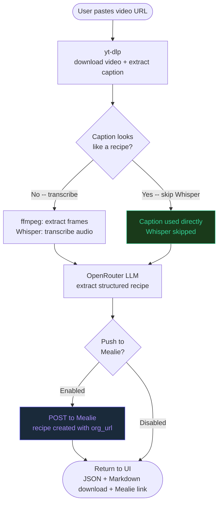
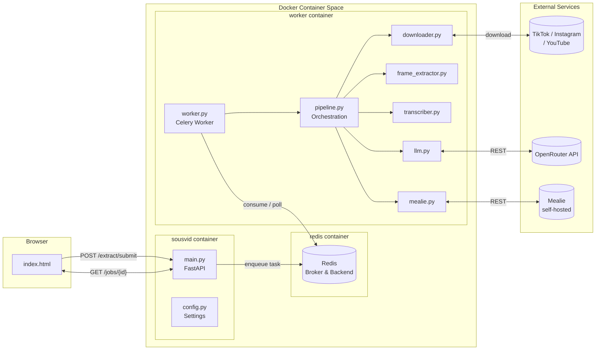

# SousVid

Turn cooking videos from Instagram Reels, TikTok, and YouTube Shorts into structured written recipes by pasting a link

Runs entirely on your homelab as a Docker container alongside your self-hosted [Mealie](https://mealie.io) instance.

---

## How it works



1. **Paste** an Instagram Reel, TikTok, or YouTube Shorts URL
2. **Wait** 30-90 seconds for the pipeline to finish
3. **Download** the recipe as Markdown or JSON, or open it directly in Mealie

> **Smart shortcut:** If the caption already contains the full recipe, the pipeline skips Whisper and sends it straight to the LLM -- faster, cheaper, and usually more accurate.

---

## Stack

| Component | Technology |
|---|---|
| API & orchestration | Python 3.12 - FastAPI |
| Asynchronous Queue | Celery + Redis |
| Video download | [yt-dlp](https://github.com/yt-dlp/yt-dlp) |
| Frame extraction | ffmpeg |
| Transcription | [faster-whisper](https://github.com/SYSTRAN/faster-whisper) (local, no cost) |
| Recipe extraction | [OpenRouter](https://openrouter.ai) (multimodal LLM) |
| Recipe output | schema.org/Recipe JSON + Markdown |
| Recipe manager | [Mealie](https://mealie.io) (self-hosted, optional) |
| Frontend | Vanilla HTML/CSS/JS (Lucide icons) |

---

## Architecture

SousVid utilizes an asynchronous architecture to handle processing without blocking requests:



For more detailed sequence diagrams and worker configuration details, see [Job Queue Architecture](docs/job_queue.md).

---

---

## Setup

### Prerequisites
- Docker + Docker Compose
- An [OpenRouter](https://openrouter.ai) API key (~$0.001/recipe with Gemini Flash)
- A self-hosted Mealie instance (optional -- you can download recipes without it)

### 1. Configure `.env`

Copy `.env.example` to `.env` and fill in your values:

```bash
cp .env.example .env
```

```env
# Required
OPENROUTER_API_KEY=sk-or-...
OPENROUTER_MODEL=google/gemini-flash-1.5

# Optional -- leave blank to skip Mealie integration
MEALIE_URL=http://your-mealie-host:9925
MEALIE_API_TOKEN=your-api-token

# Whisper settings
WHISPER_MODEL=small        # tiny | base | small | medium | large-v3
WHISPER_DEVICE=cpu         # cpu | cuda
WHISPER_COMPUTE_TYPE=int8  # int8 (CPU) | float16 (GPU)

MAX_FRAMES=6
```

See `.env.example` for all available options and their descriptions.

### 2. Instagram cookies (required for Instagram Reels)

Instagram blocks unauthenticated downloads. Export your browser session cookies:

1. Install **[Get cookies.txt LOCALLY](https://chrome.google.com/webstore/detail/get-cookiestxt-locally/cclelndahbckbenkjhflpdbgdldlbecc)** (Chrome/Edge) or the [Firefox equivalent](https://addons.mozilla.org/en-US/firefox/addon/cookies-txt/)
2. Log into Instagram in your browser
3. Navigate to `instagram.com`, click the extension -> **Export**
4. Save the file as `cookies/cookies.txt` in this directory

> TikTok and YouTube Shorts work without cookies.

### 3. Run

```bash
docker compose up -d --build
```

Open **http://localhost:8000**

---

## Usage

- Paste a video URL and click **Extract**
- Use the **Push to Mealie** toggle (default: on) to control whether the recipe is automatically saved to your Mealie instance
- Processing usually takes 30-90 seconds, depending on the video length and Whisper model you choose
- On success:
  - **JSON** -- `schema.org/Recipe` format, importable anywhere
  - **Markdown** -- human-readable document
  - **Open in Mealie** -- direct link (if push was enabled and succeeded)

### Mealie integration

When a recipe is pushed to Mealie:
- All ingredients and instructions are fully populated via `POST /api/recipes/create/html-or-json`
- The source video URL is saved in Mealie's **"Original URL"** field (`org_url`)
- The URL is also appended to the recipe description as a fallback

### Health check

```
GET /health
```

Returns the status of each subsystem (Mealie configured, LLM model in use, queue broker):

```json
{
  "status": "ok",
  "mealie": { "configured": true, "url": "http://mealie:9925" },
  "llm": { "model": "google/gemini-flash-1.5" },
  "queue": { "broker": "redis://redis:6379/0" }
}
```

---

## Whisper model guide

| Model | RAM | Speed | Accuracy |
|---|---|---|---|
| `tiny` | ~1 GB | Fastest | Low |
| `base` | ~1.5 GB | Fast | OK |
| `small` | ~2.5 GB | Good | Recommended |
| `medium` | ~5 GB | Slower | Great |
| `large-v3` | ~10 GB | Slow (needs GPU) | Best |

---

## Cost

| Component | Cost |
|---|---|
| yt-dlp, ffmpeg, Whisper | **Free** (runs locally) |
| OpenRouter (Gemini Flash) | ~$0.001 per recipe |
| OpenRouter (Claude Sonnet) | ~$0.02 per recipe |

At 50 recipes a month, expect about **$0.05** with Gemini Flash.

---

## Development

See [CONTRIBUTING.md](CONTRIBUTING.md) for code standards, patterns, and how to run tests.

```bash
pip install -r requirements-dev.txt
pytest tests/ -v
ruff check app/ tests/
```

---

## Roadmap

- [x] Mealie integration -- full recipe creation with `org_url` preserved
- [x] Push-to-Mealie toggle in the UI (default: on)
- [x] Description-first parsing -- skip Whisper when the caption has the recipe
- [x] Structured config validation at startup (pydantic-settings)
- [x] Typed exception hierarchy
- [x] Extended `/health` endpoint with subsystem status
- [ ] Mealie tag support -- tags need to exist in Mealie before they can be referenced
- [x] Job queue -- Celery + Redis enabled concurrent extractions and progress polling
- [x] Mobile share sheet -- a `/share` endpoint compatible with iOS/Android share sheets
- [ ] Batch import -- accept a list of URLs and process sequentially
- [ ] Cookie auto-refresh warning -- detect expired Instagram cookies and surface a clear UI message
- [ ] GPU support -- Dockerfile is CPU-only; add a CUDA variant for Nvidia GPU acceleration
- [ ] Mealie -- automatically try to get a recipe photo from the video (would be nice if it was cut and optimized for web viewing)