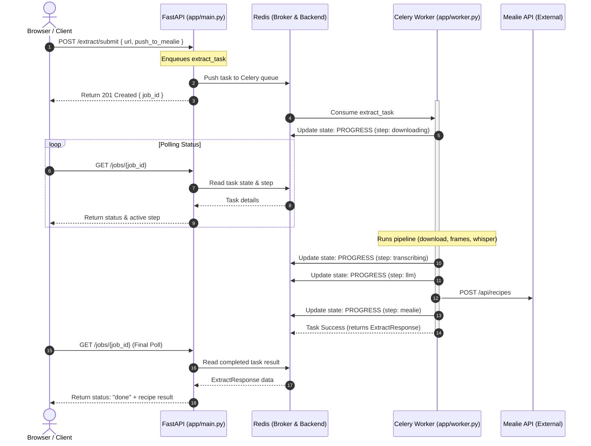

# Job Queue Architecture (Celery + Redis)

To support concurrent extractions, progress tracking, and resilient background processing, SousVid uses **Celery** with **Redis** as both the message broker and result backend.

---

## Architecture Flow

The diagram below outlines how the browser, FastAPI backend, Redis, and Celery workers interact:



---

## Why the Queue was Introduced

1. **Non-blocking API**: The extraction pipeline takes between 30 and 90 seconds to download video/audio, perform local transcription, and call the OpenRouter LLM. Running this synchronously blocks the server thread and results in client timeouts.
2. **User Experience**: The queue enables the client to receive a `job_id` instantly, add it to their visual sidebar queue, and monitor the extraction progress milestone-by-milestone.
3. **Concurrency Control**: Running Whisper transcription locally requires a high amount of CPU/RAM and is not inherently thread-safe. Moving execution to a separate worker process allows us to limit processing concurrency explicitly.

---

## Configuration & Key Files

### 1. `app/worker.py`
The Celery application is initialized here. It reads the broker URL from settings and defines the background task:
*   `worker_concurrency=1`: Limits the worker to executing exactly one task at a time (preventing CPU starvation and Whisper thread conflicts).
*   `result_expires=3600`: Keeps completed recipe results in the Redis store for 1 hour.

### 2. `docker-compose.yml`
The queue architecture introduces three containers:
*   `sousvid`: The FastAPI web server. It does not load the Whisper model into memory at startup, allowing it to boot in ~2 seconds.
*   `worker`: The Celery worker container. It loads the Whisper model and runs the heavy extraction pipeline.
*   `redis`: Serves as the message broker (passing tasks from FastAPI to the worker) and result backend (storing progress and completed recipes).

---

## API References

### Submit Job
*   **Endpoint**: `POST /extract/submit`
*   **Payload**:
    ```json
    {
      "url": "https://www.instagram.com/reel/C7xG...",
      "push_to_mealie": true
    }
    ```
*   **Response**: `200 OK`
    ```json
    {
      "job_id": "c1f73449-366a-4c28-8b89-a2924faef803"
    }
    ```

### Poll Job Status
*   **Endpoint**: `GET /jobs/{job_id}`
*   **Response (Pending/Running)**: `200 OK`
    ```json
    {
      "status": "running",
      "step": "transcribing",
      "result": null,
      "error": null
    }
    ```
*   **Response (Done)**: `200 OK`
    ```json
    {
      "status": "done",
      "step": null,
      "result": {
        "recipe": { ... },
        "mealie_url": "http://mealie:9925/recipe/avgolemono",
        "mealie_slug": "avgolemono",
        "mealie_warning": null,
        "transcript": "..."
      },
      "error": null
    }
    ```
